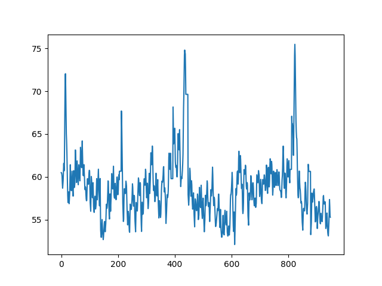
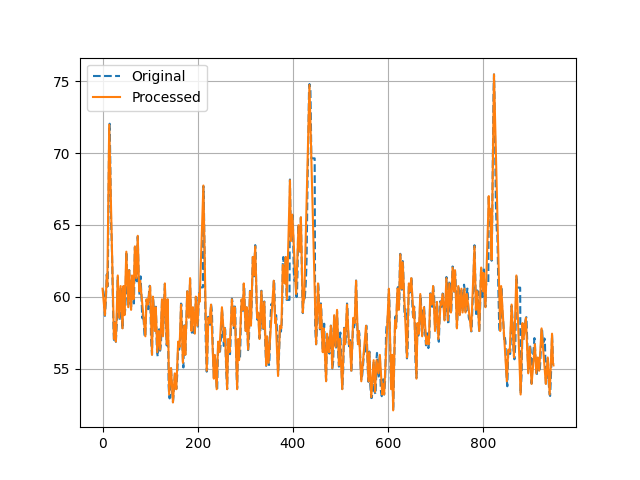

# pyrainflow

Functions for performing rainflow counting on time-history data for fatigue
cycle counting using the four-point method. Based on this article:

https://community.sw.siemens.com/s/article/rainflow-counting

## Install

After downloading, in your virtualenv, issue:

    pip install .

## Example usage

Sample data are included in the `Sample Data` directory which are heart rate
data from http://ecg.mit.edu/time-series/.

The file `hr.207` looks like the following:



After preproccessing (calling `preprocess()`) it has been simplified for cycle
counting:



A sample script applying the functions looks like:

```Python
import pandas as pd
from pyrainflow import preprocess, count4pt, plot_rm, table

# Read data into a Pandas Series object
data = pd.read_table('hr.207').squeeze()

# Pre-process the data, which returns the data as a Series along with a numpy
# array containing the discretized values (bins)
data, bins = preprocess(data)

# Call the cycle counting method, which returns a rainflow matrix and the
# residual Series
rm, residual = count4pt(data, bins)

# Print the cycles table
print(table(rm))

# Plot the rainflow matrix
plot_rm(rm, bins)
```

Yielding the following:

```
    Cycles   Range      Mean
23       2  0.3684  58.34520
0        1  0.7367  53.55665
26       1  3.6834  57.60850
28       1  2.5784  58.52940
29       1  0.7367  59.45025
30       1  0.3684  59.63440
31       1  2.0259  58.98975
32       1  0.1841  59.91065
33       1  1.8417  59.26605
34       1  0.7367  59.81855
35       1  0.5525  59.91065
36       1  2.3943  59.17395
37       1  1.8417  59.45025
38       1  1.6576  59.72650
39       1  1.4734  59.81860
40       1  2.0259  59.72645
41       1  2.0259  59.91065
42       1  0.5525  60.64735
43       1  2.9468  59.81860
44       1  1.6575  60.64735
45       1  0.7367  61.10775
46       1  1.2892  61.56820
47       1  2.9467  61.29195
48       1  1.2892  62.12070
49       1  2.2100  62.39700
27       1  0.1842  59.54230
25       1  4.0518  57.42430
1        1  1.1050  54.10920
24       1  2.2100  57.60850
2        1  2.2101  54.47755
3        1  0.9209  55.12215
4        1  0.9209  55.30635
5        1  2.7626  54.56960
6        1  0.1842  56.22720
7        1  2.0259  55.67465
8        1  0.7367  56.50345
9        1  0.3683  56.68765
10       1  1.4734  56.31930
11       1  0.9209  56.59555
12       1  1.8418  56.31930
13       1  0.5526  56.96390
14       1  1.2892  56.77970
15       1  1.2892  56.96390
16       1  1.1051  57.24015
17       1  2.9467  56.50345
18       1  2.0259  56.96385
19       1  0.1841  57.88475
20       1  1.1050  57.60850
21       1  0.7367  57.79265
22       1  0.5525  58.06895
50       1  1.8417  64.05455
```

![](Images\demo_output_rainflow_